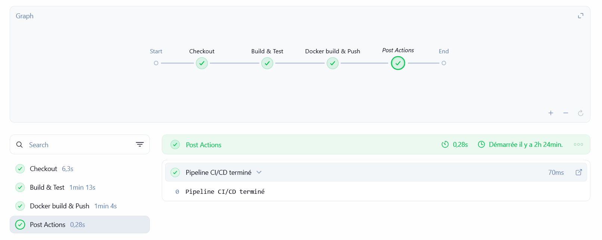

# Jenkins CI/CD Pipeline – Spring Boot Todo App

Ce dépôt contient la mise en place d’un **pipeline CI/CD Jenkins** pour une application backend **Spring Boot (Todo App)**, conteneurisée avec **Docker** et publiée sur **Docker Hub**.

Le pipeline automatise l’intégration continue depuis le dépôt GitHub jusqu’à la génération et la distribution de l’image Docker.

---

## Architecture du projet

```
.
├── backend/              # Code source Spring Boot
│   ├── src/
│   ├── pom.xml
│   ├── mvnw
│   └── mvnw.cmd
│
├── docker/
│   └── Dockerfile        # Image de l’application
│
├── jenkins/
│   └── Jenkinsfile       # Pipeline CI/CD Jenkins
│
└── README.md
```

---

## Technologies utilisées

* Spring Boot
* Jenkins (pipeline déclaratif)
* GitHub
* Docker
* Docker Hub
* Maven Wrapper
* Base de données H2 (environnement de test)

---

## Fonctionnement du pipeline Jenkins

Le pipeline est défini dans un **Jenkinsfile déclaratif** et s’exécute automatiquement à chaque déclenchement du job.

### Étapes du pipeline

1. **Checkout**

   * Récupération du code source depuis le dépôt GitHub.

2. **Build**

   * Compilation de l’application Spring Boot via `mvnw`.

3. **Tests**

   * Exécution des tests unitaires Maven.

4. **Packaging**

   * Génération du fichier `app.jar`.

5. **Build de l’image Docker**

   * Construction de l’image Docker à partir du `Dockerfile`.
   * Tag de l’image basé sur le commit Git.

6. **Push vers Docker Hub**

   * Authentification sécurisée via credentials Jenkins.
   * Publication automatique de l’image dans le registry Docker Hub.

7. **Post actions**

   * Gestion des statuts `success`, `failure` et `always`.
   * Affichage des logs de fin de pipeline.



---

## Registry Docker

Les images générées sont publiées sur **Docker Hub** :

```
docker pull <dockerhub-username>/todo-app:<tag>
```

Le tag est automatiquement généré à partir du hash Git pour assurer la traçabilité des builds.

---

## Configuration Jenkins requise

* Jenkins exécuté sur un node disposant de :

  * Docker CLI
  * Accès au daemon Docker (Docker Desktop TCP sous Windows)
* Credentials Docker Hub configurés dans Jenkins
* Docker Desktop avec le daemon exposé via TCP

---

## Lancement local de l’image

```bash
docker run -p 8081:8081 <dockerhub-username>/todo-app:<tag>
```

L’application est accessible sur :

```
http://localhost:8081
```